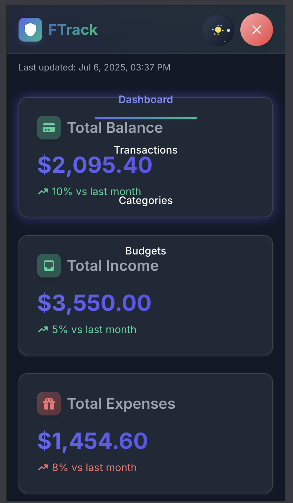

# FinIQ: Personalised Finance Tracker

<!-- <div align="center">
  
</div> -->

A comprehensive full-stack web application for tracking personal finances with detailed visualization capabilities and AI-powered insights. Monitor your transactions, categorize expenses, set budgets, and gain insights into your spending patterns through interactive charts, analytics, and a helpful chatbot assistant.


<!--  -->

## ✨ Features

### Transaction Management
- **Add/Edit/Delete Transactions**: Track expenses and income with amount, date, description, and category
- **Transaction Filtering**: Filter by date range, category, or transaction type
- **Transaction List**: Sortable and paginated list view with search functionality

### Category Management
- **Custom Categories**: Create, edit, and delete expense and income categories
- **Color Coding**: Assign colors to categories for better visualization
- **Category Overview**: View spending patterns by category

### Budget Planning
- **Monthly Budgets**: Set spending limits for each category on a monthly basis
- **Budget Tracking**: Monitor progress with visual indicators showing budget vs. actual spending
- **Budget History**: Track budget performance over time

### Analytics & Visualizations
- **Dashboard Overview**: Quick summary of financial status with key metrics
- **Monthly Expenses Chart**: Bar chart showing expenses by month
- **Category Breakdown**: Interactive pie chart displaying spending by category
- **Budget Comparison**: Visual representation of planned vs. actual spending

### AI-Powered Features
- **Chatbot Assistant**: AI-powered financial assistant that can answer questions about your finances
- **Spending Insights**: Get personalized recommendations based on your spending patterns
- **Natural Language Queries**: Ask questions about your finances in plain English
- **Expense Analysis**: Receive AI-generated analysis of your spending habits

### UI/UX Features
- **Responsive Design**: Fully responsive interface that works on mobile, tablet, and desktop
- **Dark/Light Theme**: Toggle between dark and light themes with smooth transitions
- **Modern UI Components**: Built with shadcn/ui for a clean, consistent look
- **Form Validation**: Comprehensive client-side validation for all forms
- **Error Handling**: Graceful error states with user-friendly messages

## 🛠️ Tech Stack

### Frontend
- **React 19**: Modern component-based UI library
- **React Router 7**: For client-side routing with the latest features
- **Context API**: For global state management
- **Recharts**: Flexible charting library for data visualization
- **Axios**: Promise-based HTTP client for API requests
- **PropTypes**: Runtime type checking for React props
- **Tailwind CSS**: Utility-first CSS framework for styling
- **shadcn/ui**: High-quality UI components built on Radix UI
- **date-fns**: Modern JavaScript date utility library

### Backend
- **Express.js**: Fast, unopinionated web framework for Node.js
- **MongoDB**: NoSQL database for flexible data storage
- **Mongoose**: MongoDB object modeling for Node.js
- **RESTful API**: Well-structured endpoints following REST principles
- **Express Validator**: Middleware for request validation
- **Helmet**: Security middleware to protect Express apps
- **CORS**: Cross-Origin Resource Sharing support
- **Morgan**: HTTP request logger middleware
- **dotenv**: Environment variable management

### AI Integration
- **Google Generative AI (Gemini)**: Advanced language model for chatbot functionality
- **Natural Language Processing**: Understand and respond to user queries about finances
- **Financial Insights**: AI-powered analysis of spending patterns and budget recommendations

## 📁 Project Structure

```
/client                # React frontend
  /public              # Public assets and static files
    /Assets            # Images and other static assets
  /src                 # Source code
    /api               # API service layer with Axios
    /components        # Reusable UI components
      /budgets         # Budget-related components
      /categories      # Category-related components
      /charts          # Data visualization components
      /dashboard       # Dashboard components
      /layout          # Layout components (header, footer)
      /transactions    # Transaction-related components
      /ui              # Base UI components (buttons, inputs, theme switcher)
    /context           # React Context providers for global state
    /lib               # Utility functions and helpers
    /pages             # Page components
    /services          # Service layer for external API integration
    /utils             # Utility functions including AI helper
    
/server                # Express.js backend
  /models              # MongoDB/Mongoose data models
  /routes              # API route handlers
  /utils               # Utility functions and database seeders
```

## 🚀 Getting Started

### Prerequisites
- **Node.js**: v18.0.0 or higher
- **MongoDB**: v5.0 or higher
- **npm**: v8.0.0 or higher
- **Google Generative AI API Key**: Required for chatbot functionality (get from https://ai.google.dev/)

### Installation

1. **Clone the repository**
```bash
git clone https://github.com/theshivay/Personalised-Finance-Tracker.git
cd Personalised-Finance-Tracker
```

2. **Server Setup**
```bash
cd server
npm install

# Create a .env file with:
# PORT=5001
# MONGODB_URI=mongodb://localhost:27017/finance-tracker
```

3. **Client Setup**
```bash
cd ../client
npm install

# Create a .env file with:
# REACT_APP_GEMINI_API_KEY=your_gemini_api_key
# REACT_APP_API_URL=http://localhost:5001/api
```

4. **Seed the database** (optional)
```bash
cd ../server
npm run seed
```

5. **Start the development servers**
```bash
# Terminal 1: Start the backend server
cd server
npm run dev

# Terminal 2: Start the frontend development server
cd client
npm start
```

The application will be available at:
- Frontend: http://localhost:3000
- Backend API: http://localhost:5001/api

## 📊 Data Models

### Transaction
- `amount`: Number (positive for income, negative for expenses)
- `description`: String
- `date`: Date
- `type`: String (expense/income)
- `categoryId`: ObjectId (reference to Category)
- `paymentMethod`: String
- `notes`: String

### Category
- `name`: String
- `color`: String (hex color code)
- `icon`: String
- `type`: String (expense/income/both)
- `isDefault`: Boolean

### Budget
- `categoryId`: ObjectId (reference to Category)
- `amount`: Number
- `month`: Number (1-12)
- `year`: Number
- `notes`: String

## 📡 API Endpoints

### Transactions
- `GET /api/transactions` - List all transactions
- `POST /api/transactions` - Create a new transaction
- `GET /api/transactions/:id` - Get a transaction by ID
- `PUT /api/transactions/:id` - Update a transaction
- `DELETE /api/transactions/:id` - Delete a transaction

### Categories
- `GET /api/categories` - List all categories
- `POST /api/categories` - Create a new category
- `GET /api/categories/:id` - Get a category by ID
- `PUT /api/categories/:id` - Update a category
- `DELETE /api/categories/:id` - Delete a category

### Budgets
- `GET /api/budgets` - List all budgets
- `POST /api/budgets` - Create a new budget
- `GET /api/budgets/:id` - Get a budget by ID
- `PUT /api/budgets/:id` - Update a budget
- `DELETE /api/budgets/:id` - Delete a budget

### Analytics
- `GET /api/analytics/monthly-expenses` - Get expenses grouped by month
- `GET /api/analytics/category-breakdown` - Get expenses grouped by category
- `GET /api/analytics/budget-comparison` - Compare budgets with actual spending

## 📝 Development Guidelines

### Code Style
- Follow the ESLint configuration in the project
- Use meaningful variable and function names
- Comment complex logic and business rules

### Component Structure
- Keep components focused on a single responsibility
- Use PropTypes for component props validation
- Extract reusable logic into custom hooks

### State Management
- Use React Context for global state
- Keep component state local when possible
- Use state reducers for complex state logic

## 🔄 Development Workflow

1. **Setup**: Clone repo and install dependencies
2. **Development**: Make changes in a feature branch
3. **Testing**: Test changes in local environment
4. **Pull Request**: Submit PR with detailed description
5. **Code Review**: Address feedback and make necessary adjustments
6. **Merge**: Merge changes into main branch
7. **Deploy**: Deploy to production environment

## 🤝 Contribution
Contributions are welcome! Feel free to submit a pull request or open an issue.

1. Fork the repository
2. Create your feature branch: `git checkout -b feature/amazing-feature`
3. Commit your changes: `git commit -m 'Add some amazing feature'`
4. Push to the branch: `git push origin feature/amazing-feature`
5. Open a pull request

## 🔒 Security
- All sensitive data is stored securely
- API keys are kept in environment variables
- HTTPS is used for all communication with the backend
- User data is never shared with third parties

<!-- ## 🏷️ Branding & Business Name Options

### FinIQ
This name combines "Finance" with "IQ", suggesting financial intelligence and smart money management. The "IQ" also hints at the AI-powered features that help users make intelligent financial decisions.

### Other Business Name Options:
1. **WealthWise**: Emphasizes making wise financial decisions for building wealth
2. **MoneyMentor**: Positions the app as a guide or mentor for financial decisions
3. **FiscalAI**: Directly references the AI-powered financial assistance features
4. **SmartSpend**: Focuses on the app's ability to help users spend more intelligently
5. **BudgetBrain**: Highlights the intelligent budgeting capabilities
6. **FinFlow**: Suggests smooth financial management and cash flow tracking
7. **WalletWiz**: Positions the app as a financial wizard for your wallet
8. **CashCompass**: Implies guidance through financial decisions
9. **ExpenseExpert**: Emphasizes expertise in tracking and analyzing expenses
10. **PennySage**: Combines penny-wise decision making with financial wisdom -->

## 🔜 Upcoming Features
- **Recurring Transactions**: Set up automatic tracking of regular expenses and income
- **Export/Import**: Export data to CSV/PDF or import from bank statements
- **Advanced Analytics**: More detailed insights with year-over-year comparisons
- **Mobile App**: Native mobile applications for iOS and Android
- **Enhanced AI Features**: More advanced financial advice and predictions

## 📧 Contact
If you have any questions or need further assistance, feel free to contact:

- **Developer**: Shivam Mishra
- **GitHub**: [theshivay](https://github.com/theshivay)
- **Email**: shivammishraeee@gmail.com
<!-- - **Portfolio**: [shivammishra.dev](https://shivammishra.dev) -->
<!-- - **LinkedIn**: [shivammishra](https://www.linkedin.com/in/shivammishra/) -->

<!-- ## 📄 License
This project is licensed under the MIT License - see the LICENSE file for details. -->